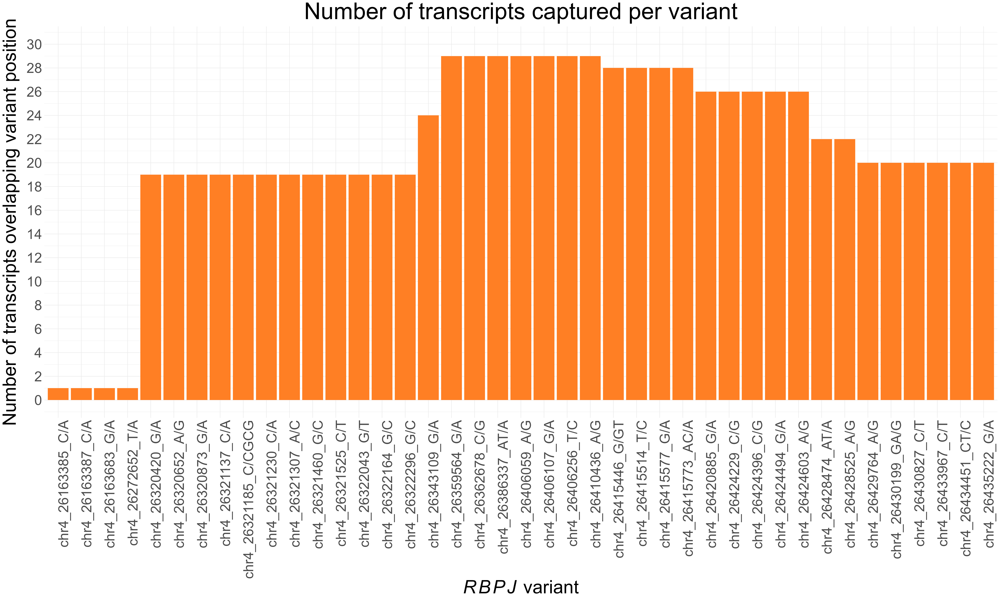
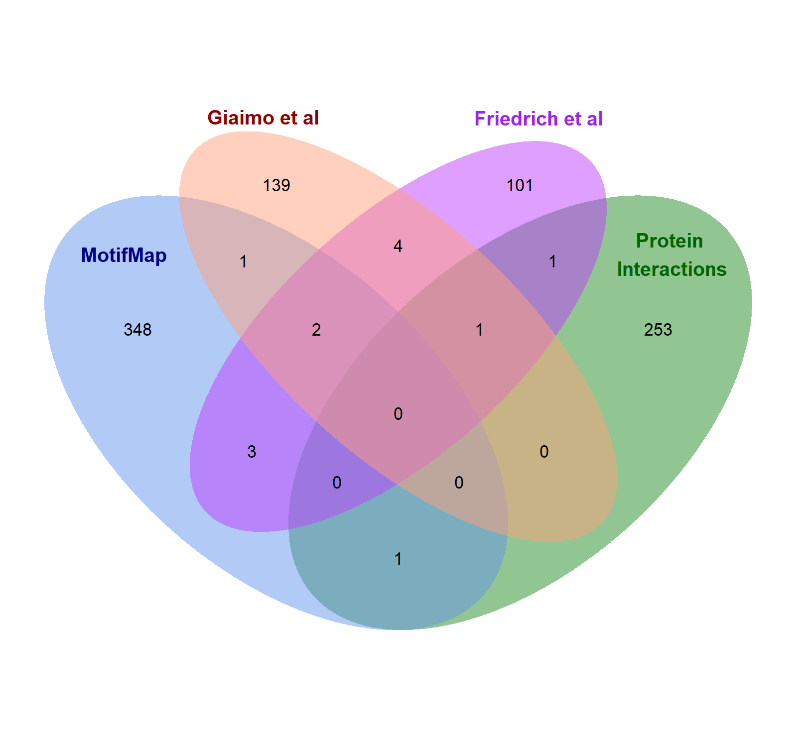

```{r setup, include=FALSE}
knitr::opts_chunk$set(echo = TRUE)
```

### Example R code for extracting called variants from 562 MotifMap candidate genes

```{r directory, include=FALSE}
setwd("~/Masters/Research Project/Figures/Appendix")
```

#### Load Packages
```{r, message=FALSE, warning=FALSE}
library("readxl")
```

```{r, include=FALSE}
df1 <- data.frame(read_excel("R_MotifMap_Genes_ID.xlsx"))
df2 <- data.frame(read_excel("Variants_table_AOS.xlsx"))
```

#### Import data
Two input files were created.

File one: The names of the 562 candidate gene identified by MotifMap (Displaying first four lines of the file)
```{r, echo=FALSE}
head(df1, n = 4)
```

File two: the .vcf file containing all called variants and their corresponding gene (Displaying first four lines of select columns)
```{r, echo=FALSE}
head(df2[, c("CHROM_POS_REF_ALT", "Consequence", "IMPACT", "SYMBOL")], 4)
```

#### Both files were loaded into R
```{r}
df1 <- data.frame(read_excel("R_MotifMap_Genes_ID.xlsx"))
df2 <- data.frame(read_excel("Variants_table_AOS.xlsx"))
```

#### Extract rows containing genes of interest
```{r}
df3 <- df2[df2$SYMBOL %in% df1$Gene_IDs, ]
```

#### Save extracted gene names to excel
```{r, warning=FALSE}
write.csv(df3,"ExtractedGenes_MotifMap.csv",sep = "\t",quote = FALSE)
```


### Example R code to extract patient genotype for prioritised variants

```{r, include=FALSE}
MotifHigh_df1 <- data.frame(read_excel("R_MotifMap_HighImpact_Position_ID.xlsx"))
MotifMis_df1 <- data.frame(read_excel("R_MotifMap_Missense_Position_ID.xlsx"))
Geno_df2 <- data.frame(read_excel("Genotype_table_AOS.xlsx"))
```

#### Import data
Three input files were created.

File one: listing all high impact prioritized variants (Displaying first four lines of the file)
```{r, echo=FALSE}
head(MotifHigh_df1, n = 4)
```

File two: listing all missense prioritized variants (Displaying first four lines of the file)
```{r, echo=FALSE}
head(MotifMis_df1, n = 4)
```

File three: the .vcf file containing all called variants and the corresponding genotype of each patient (Displaying first four lines of select columns)
```{r, echo=FALSE}
head(Geno_df2[, c("CHROM_POS_REF_ALT", "X21924", "X21925")], 4)
```

#### All files were loaded into R
```{r}
MotifHigh_df1 <- data.frame(read_excel("R_MotifMap_HighImpact_Position_ID.xlsx"))
MotifMis_df1 <- data.frame(read_excel("R_MotifMap_Missense_Position_ID.xlsx"))
Geno_df2 <- data.frame(read_excel("Genotype_table_AOS.xlsx"))
```

#### Extract rows containing variants of interest
```{r}
# High Impact Variants
MotifHigh_df3 <- Geno_df2[Geno_df2$CHROM_POS_REF_ALT %in% MotifHigh_df1$CHROM_POS_REF_ALT, ]

# Missense Variants
MotifMis_df3 <- Geno_df2[Geno_df2$CHROM_POS_REF_ALT %in% MotifMis_df1$CHROM_POS_REF_ALT, ]
```

#### Save extracted gene names to excel
```{r, warning=FALSE}
write.csv(MotifHigh_df3,"ExtractedGenotype_MotifMap_HighImpact.csv",sep = "\t",quote = FALSE)
write.csv(MotifMis_df3,"ExtractedGenotype_MotifMap_Missense.csv",sep = "\t",quote = FALSE)
```


### Figure 5: Number of transcripts captured per variant 

#### Load Packages
```{r, message=FALSE, warning=FALSE}
library("ggplot2")
```

```{r, include=FALSE}
variant_summary <- read.table("R_Histogram.txt", header = TRUE)
```

#### Import data
One input file was created.

File one: The number of transcripts captured for each variant (Displaying first four lines of the file)
```{r, echo=FALSE}
head(variant_summary, n = 4)
```

#### This file was loaded into R
```{r}
variant_summary <- read.table("R_Histogram.txt", header = TRUE)
```

#### Plot the data
```{r}
p <- ggplot(variant_summary, aes(x = Variant, y = Transcripts_captured)) +
  geom_bar(stat = "identity", fill = "chocolate1") +
  labs(title = "Number of transcripts captured per variant",
       x = expression(italic(RBPJ) * " variant"),
       y = "Number of transcripts overlapping variant position") +
  scale_y_continuous(
    limits = c(0, 30),
    breaks = seq(0, 30, by = 2),
  ) +
  theme_minimal() +
  theme(
    axis.text.x = element_text(size = 30, angle = 90, hjust = 1),
    axis.text.y = element_text(size = 30),
    axis.title.x = element_text(size = 40),
    axis.title.y = element_text(size = 40, margin = margin(r = 15)),
    plot.title = element_text(size =50, hjust = 0.5)
    )
```

```{r, echo=FALSE, out.width="70%"}

```


#### Save the bar chart
```{r, warning=FALSE}
ggsave("Variants_Captured_barchart.png", plot = p, width = 30, height = 18, dpi = 300, bg = "white")
```


### Figure 7: Venn diagram showing degree of gene overlap between candidate gene datasets 

#### Load Packages
```{r, message=FALSE, warning=FALSE}
library("VennDiagram")
library("readxl")
library("RColorBrewer")
library("ggplot2")
```

```{r, include=FALSE}
All_Genes <- data.frame(read_excel("R_VennDiagram.xlsx"))
```

#### Import data
One input file was created.

File one: The names of all candidate genes identified in each dataset: Motifmap, Giaimo *et al*. 2024, Friedrich *et al*. 2022 and Protein interactions (Displaying first four lines of the file)
```{r, echo=FALSE}
head(variant_summary, n = 4)
```

#### This file was loaded into R
```{r}
All_Genes <- data.frame(read_excel("R_VennDiagram.xlsx"))
```

#### Each column was defined as an individual data frame
```{r, warning=FALSE}
Motif <- All_Genes[c("MOTIFMAP")]
Proteins <- All_Genes[c("PROTEINS")]
Giaimo <- All_Genes[c("GIAIMO")]
Friedrich <- All_Genes[c("FRIEDRICH")]
```

#### NA values were removed
```{r, warning=FALSE}
Motif <- Motif[!is.na(Motif)]
Proteins <- Proteins[!is.na(Proteins)]
Giaimo <- Giaimo[!is.na(Giaimo)]
Friedrich <- Friedrich[!is.na(Friedrich)]
```

#### Each data frame was assigned to one variable "x"
```{r}
x <- list(
  Set1 = Motif,
  Set2 = Proteins,
  Set3 = Giaimo,
  Set4 = Friedrich
)
```

#### Plot the data
```{r, warning=FALSE, message=FALSE, results='hide'}
venn.diagram(
  x,
  category.names = c("MotifMap" , "Protein \nInteractions" , "Giaimo et al", "Friedrich et al"),
  filename = 'venn_diagram.png',
  output = TRUE ,
  imagetype="png" ,
  height = 1500 , 
  width = 1600 , 
  resolution = 300,
  compression = "lzw",
  lwd = 1,
  col="transparent",
  fill = c("cornflowerblue", "forestgreen", "lightsalmon", "darkorchid1"),
  alpha = 0.50,
  cex = 0.7,
  fontfamily = "Arial",
  cat.col = c("darkblue", "darkgreen", "darkred", "purple"),
  cat.cex = 0.8,
  cat.fontface = "bold",
  cat.fontfamily = "Arial",
  rotation.degree = 0,
  margin = 0.05,
  cat.pos = c(-10, 10, -10, 15),
  cat.dist = c(0.1, 0.1, 0.09, 0.09)
)
```

```{r, echo=FALSE, out.width="70%"}

```
