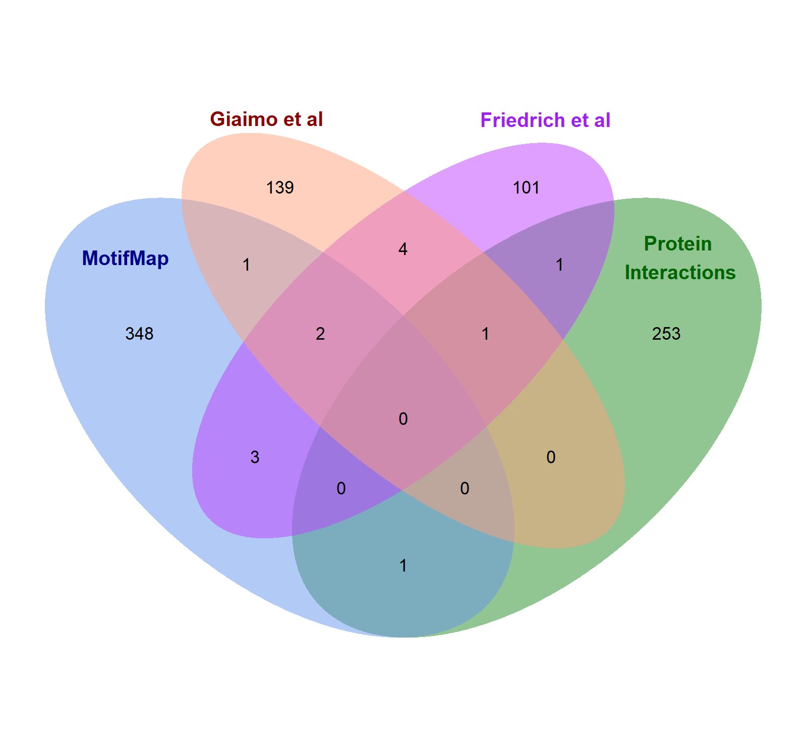

### Example R code for extracting called variants from 562 MotifMap candidate genes

#### Load Packages

    library("readxl")

#### Import data

Two input files were created.

File one: The names of the 562 candidate gene identified by MotifMap
(Displaying first four lines of the file)

    ##   Gene_IDs
    ## 1     AAK1
    ## 2    ABCB1
    ## 3    ABHD4
    ## 4    ABTB2

File two: the .vcf file containing all called variants and their
corresponding gene (Displaying first four lines of select columns)

    ##    CHROM_POS_REF_ALT                                  Consequence   IMPACT
    ## 1     chr1_13273_G_C           non_coding_transcript_exon_variant MODIFIER
    ## 2 chr1_13417_C_CGAGA intron_variant&non_coding_transcript_variant MODIFIER
    ## 3     chr1_13418_G_A intron_variant&non_coding_transcript_variant MODIFIER
    ## 4     chr1_13494_A_G           non_coding_transcript_exon_variant MODIFIER
    ##    SYMBOL
    ## 1 DDX11L1
    ## 2 DDX11L1
    ## 3 DDX11L1
    ## 4 DDX11L1

#### Both files were loaded into R

    df1 <- data.frame(read_excel("R_MotifMap_Genes_ID.xlsx"))
    df2 <- data.frame(read_excel("Variants_table_AOS.xlsx"))

#### Extract rows containing genes of interest

    df3 <- df2[df2$SYMBOL %in% df1$Gene_IDs, ]

#### Save extracted gene names to excel

    write.csv(df3,"ExtractedGenes_MotifMap.csv",sep = "\t",quote = FALSE)

### Example R code to extract patient genotype for prioritised variants

#### Import data

Three input files were created.

File one: listing all high impact prioritized variants (Displaying first
four lines of the file)

    ##     CHROM_POS_REF_ALT
    ## 1   chr2_69514497_G_A
    ## 2  chr11_34204691_C_A
    ## 3 chr15_83897888_T_TA
    ## 4   chr1_64664657_T_C

File two: listing all missense prioritized variants (Displaying first
four lines of the file)

    ##    CHROM_POS_REF_ALT
    ## 1 chr14_32696004_A_T
    ## 2 chr3_187725536_G_T
    ## 3  chr6_41940548_G_T
    ## 4 chr15_40953783_G_T

File three: the .vcf file containing all called variants and the
corresponding genotype of each patient (Displaying first four lines of
select columns)

    ##    CHROM_POS_REF_ALT X21924 X21925
    ## 1     chr1_13273_G_C    0/0    ./.
    ## 2 chr1_13417_C_CGAGA    0/0    0/0
    ## 3     chr1_13418_G_A    0/0    0/0
    ## 4     chr1_13494_A_G    0/0    0/0

#### All files were loaded into R

    MotifHigh_df1 <- data.frame(read_excel("R_MotifMap_HighImpact_Position_ID.xlsx"))
    MotifMis_df1 <- data.frame(read_excel("R_MotifMap_Missense_Position_ID.xlsx"))
    Geno_df2 <- data.frame(read_excel("Genotype_table_AOS.xlsx"))

#### Extract rows containing variants of interest

    # High Impact Variants
    MotifHigh_df3 <- Geno_df2[Geno_df2$CHROM_POS_REF_ALT %in% MotifHigh_df1$CHROM_POS_REF_ALT, ]

    # Missense Variants
    MotifMis_df3 <- Geno_df2[Geno_df2$CHROM_POS_REF_ALT %in% MotifMis_df1$CHROM_POS_REF_ALT, ]

#### Save extracted gene names to excel

    write.csv(MotifHigh_df3,"ExtractedGenotype_MotifMap_HighImpact.csv",sep = "\t",quote = FALSE)
    write.csv(MotifMis_df3,"ExtractedGenotype_MotifMap_Missense.csv",sep = "\t",quote = FALSE)

### Figure 5: Number of transcripts captured per variant

#### Load Packages

    library("ggplot2")

#### Import data

One input file was created.

File one: The number of transcripts captured for each variant
(Displaying first four lines of the file)

    ##             Variant Transcripts_captured
    ## 1 chr4_26163385_C/A                    1
    ## 2 chr4_26163387_C/A                    1
    ## 3 chr4_26163683_G/A                    1
    ## 4 chr4_26272652_T/A                    1

#### This file was loaded into R

    variant_summary <- read.table("R_Histogram.txt", header = TRUE)

#### Plot the data

    p <- ggplot(variant_summary, aes(x = Variant, y = Transcripts_captured)) +
      geom_bar(stat = "identity", fill = "chocolate1") +
      labs(title = "Number of transcripts captured per variant",
           x = expression(italic(RBPJ) * " variant"),
           y = "Number of transcripts overlapping variant position") +
      scale_y_continuous(
        limits = c(0, 30),
        breaks = seq(0, 30, by = 2),
      ) +
      theme_minimal() +
      theme(
        axis.text.x = element_text(size = 30, angle = 90, hjust = 1),
        axis.text.y = element_text(size = 30),
        axis.title.x = element_text(size = 40),
        axis.title.y = element_text(size = 40, margin = margin(r = 15)),
        plot.title = element_text(size =50, hjust = 0.5)
        )

#### Save the bar chart

    ggsave("Variants_Captured_barchart.png", plot = p, width = 30, height = 18, dpi = 300, bg = "white")

### Figure 7: Venn diagram showing degree of gene overlap between candidate gene datasets

#### Load Packages

    library("VennDiagram")
    library("readxl")
    library("RColorBrewer")
    library("ggplot2")

#### Import data

One input file was created.

File one: The names of all candidate genes identified in each dataset:
Motifmap, Giaimo *et al*. 2024, Friedrich *et al*. 2022 and Protein
interactions (Displaying first four lines of the file)

    ##             Variant Transcripts_captured
    ## 1 chr4_26163385_C/A                    1
    ## 2 chr4_26163387_C/A                    1
    ## 3 chr4_26163683_G/A                    1
    ## 4 chr4_26272652_T/A                    1

#### This file was loaded into R

    All_Genes <- data.frame(read_excel("R_VennDiagram.xlsx"))

#### Each column was defined as an individual data frame

    Motif <- All_Genes[c("MOTIFMAP")]
    Proteins <- All_Genes[c("PROTEINS")]
    Giaimo <- All_Genes[c("GIAIMO")]
    Friedrich <- All_Genes[c("FRIEDRICH")]

#### NA values were removed

    Motif <- Motif[!is.na(Motif)]
    Proteins <- Proteins[!is.na(Proteins)]
    Giaimo <- Giaimo[!is.na(Giaimo)]
    Friedrich <- Friedrich[!is.na(Friedrich)]

#### Each data frame was assigned to one variable “x”

    x <- list(
      Set1 = Motif,
      Set2 = Proteins,
      Set3 = Giaimo,
      Set4 = Friedrich
    )

#### Plot the data

    venn.diagram(
      x,
      category.names = c("MotifMap" , "Protein \nInteractions" , "Giaimo et al", "Friedrich et al"),
      filename = 'venn_diagram.png',
      output = TRUE ,
      imagetype="png" ,
      height = 1500 , 
      width = 1600 , 
      resolution = 300,
      compression = "lzw",
      lwd = 1,
      col="transparent",
      fill = c("cornflowerblue", "forestgreen", "lightsalmon", "darkorchid1"),
      alpha = 0.50,
      cex = 0.7,
      fontfamily = "Arial",
      cat.col = c("darkblue", "darkgreen", "darkred", "purple"),
      cat.cex = 0.8,
      cat.fontface = "bold",
      cat.fontfamily = "Arial",
      rotation.degree = 0,
      margin = 0.05,
      cat.pos = c(-10, 10, -10, 15),
      cat.dist = c(0.1, 0.1, 0.09, 0.09)
    )

